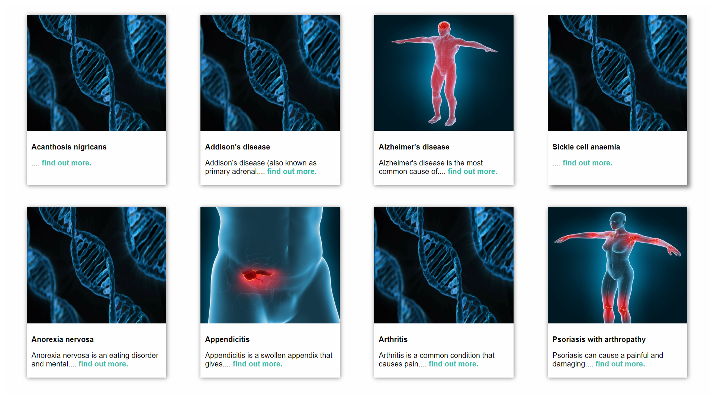
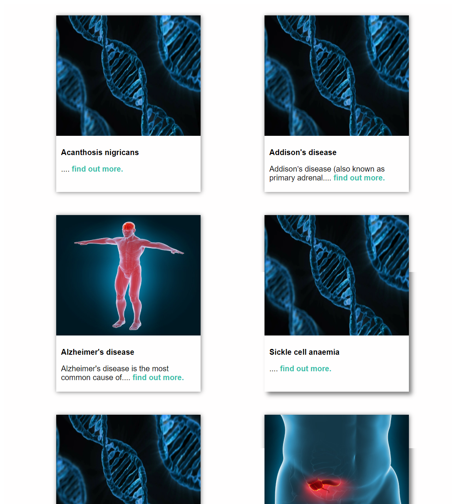
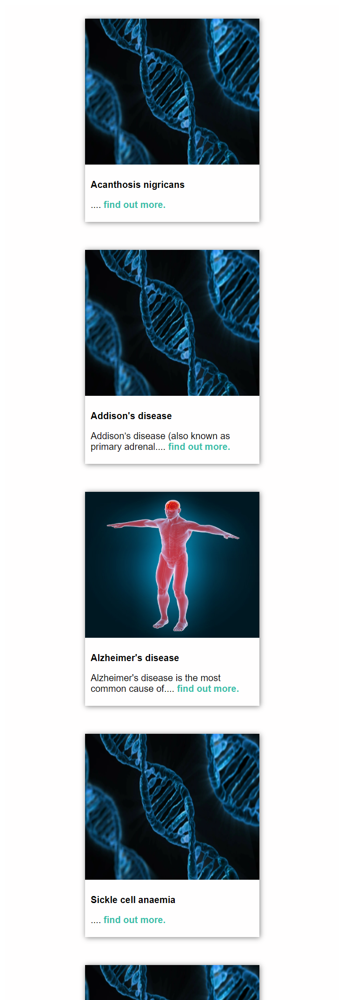

# Simple Serverless Full Stack Application
This  simple responsive Single Page Application developed to solve an pre-interview coding challange

## ScreenShots

- Screenshot of page desktop layout

- Screenshot of page responsive layout Medium Screen

- Screenshot of page responsive layout Small Screen

## Project Structure
  The project consist of a back end (condition-service) and a front end.
  - Back End:
        
    - Created with Nodejs, Expressjs Framework and typescript and Serveless Framework
    - is a deployable to AWS Lambda
  - Front End: 
     
    - It is a responsive Single page that requests data with axios from the backend and displays this data.
    - Created with React.js and Typscript
## Installation
  The project has 2 main folders:

 - Frontend (React Front-End)
 - condition-service (Express Serverless Back-End)

 The backend depends on Serverless Framework, it can be installed with the following command `npm install -g serverless`
 
 Then run npm install in both folders to install the dependencies.

 To start Backend server:
  - locally run :

       `sls offline start --skipCacheInvalidation` in the condition-service folder

  - Deploy it on AWS: 

      `sls deploy` and follow the instructions.
 
 To Start the frontend: 

  -  `npm start` in the frontend folder

  IMPORTANT:  If the server is deployed to AWS, copy the endpoint it returns and paste it in frontend/App.tsx line 11 `axios.defaults.baseURL` 

## Design decisions:
 - Some of the data are missing the image, to come over this issue a generic image is used.
 - If an image is broken the generic image will replace it.
 - To get a unified design, the height of the images is fixed to 250px.

 